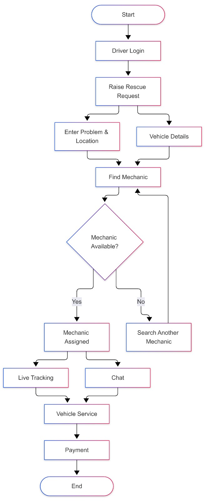
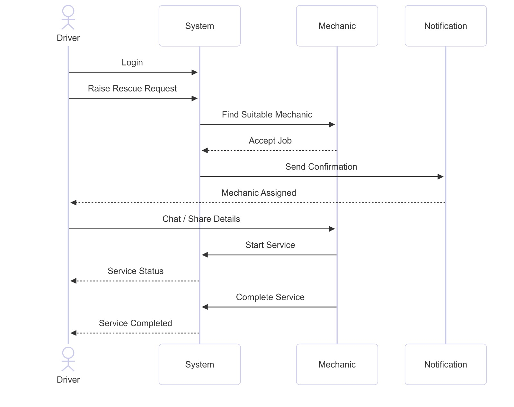
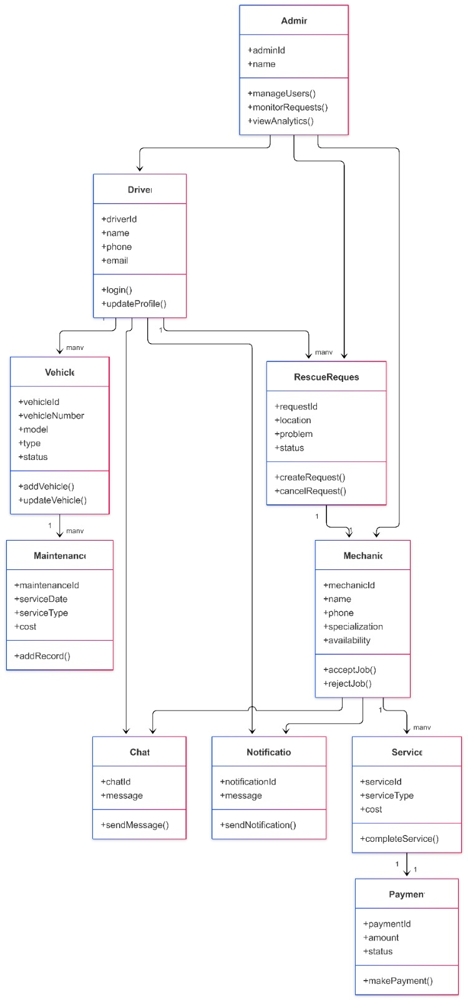
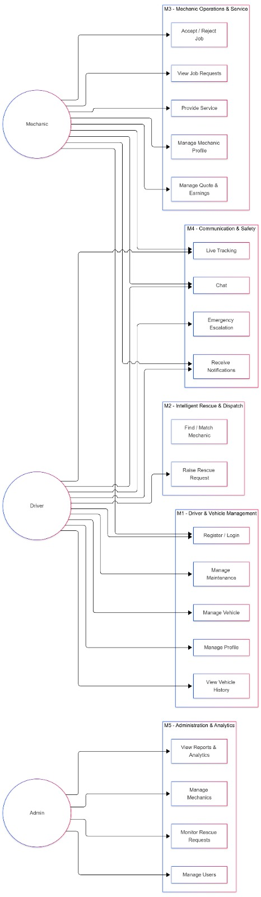
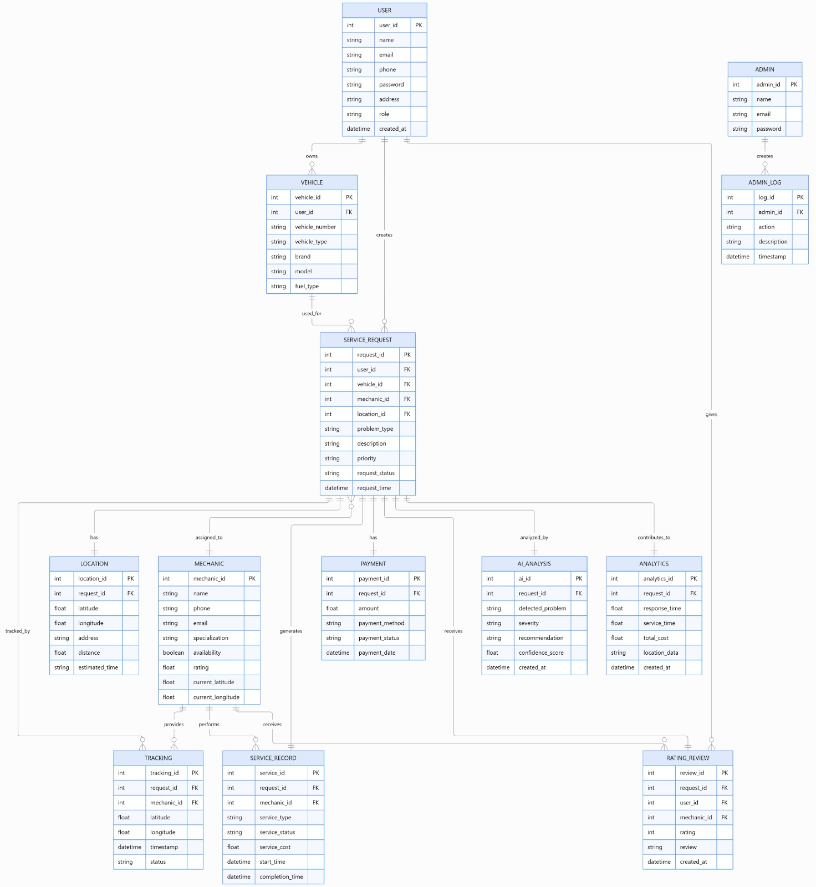
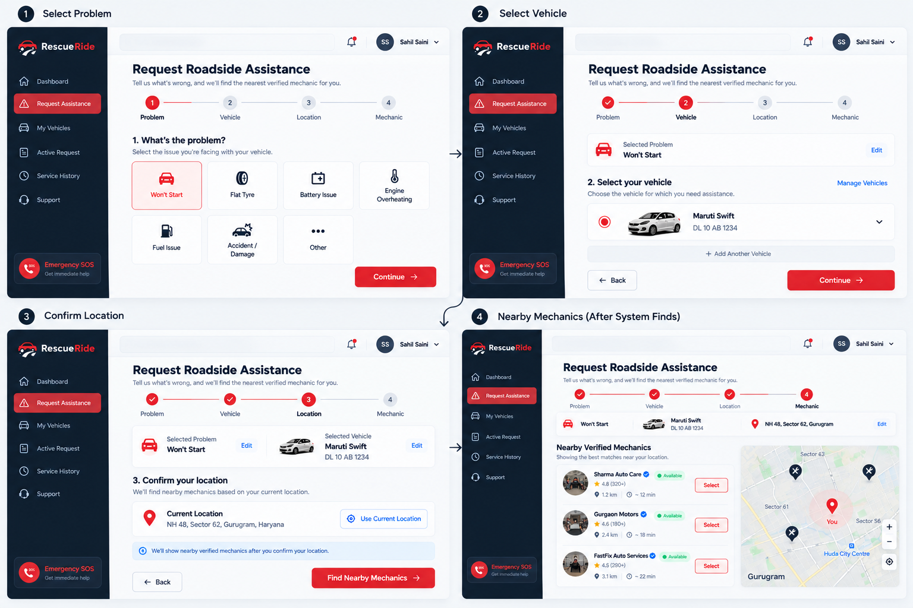
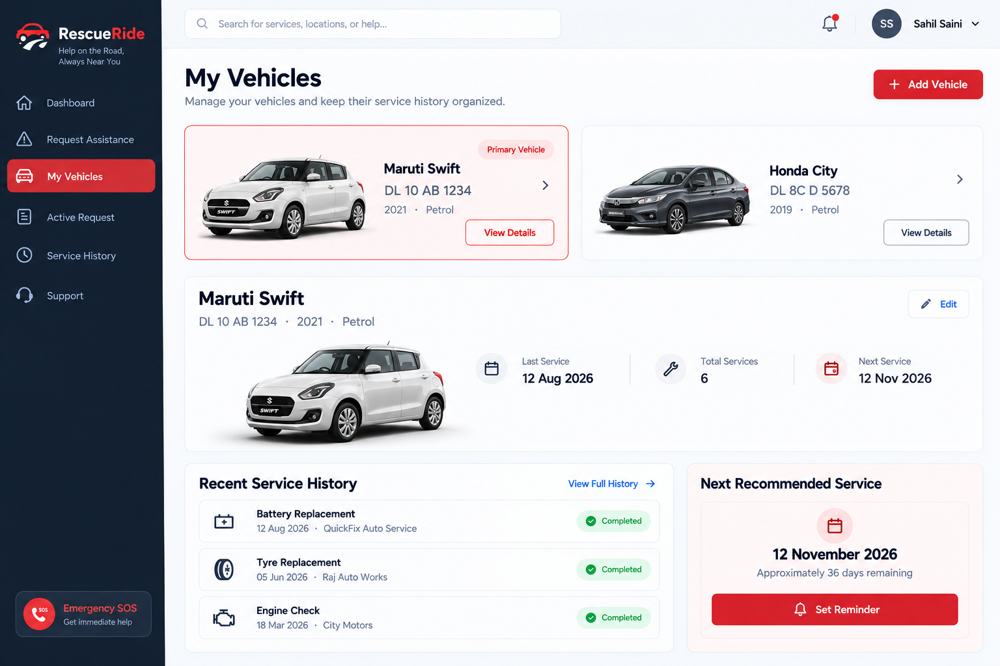
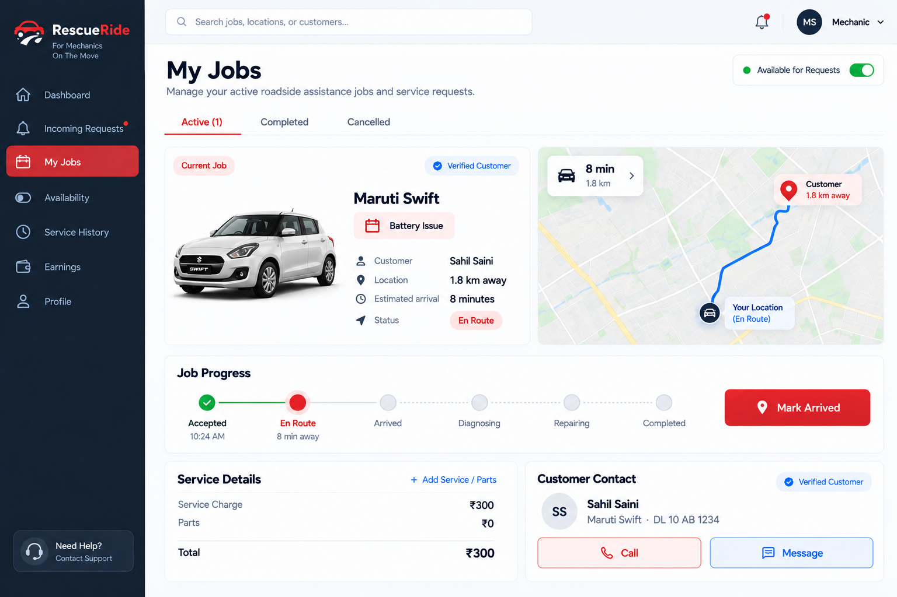
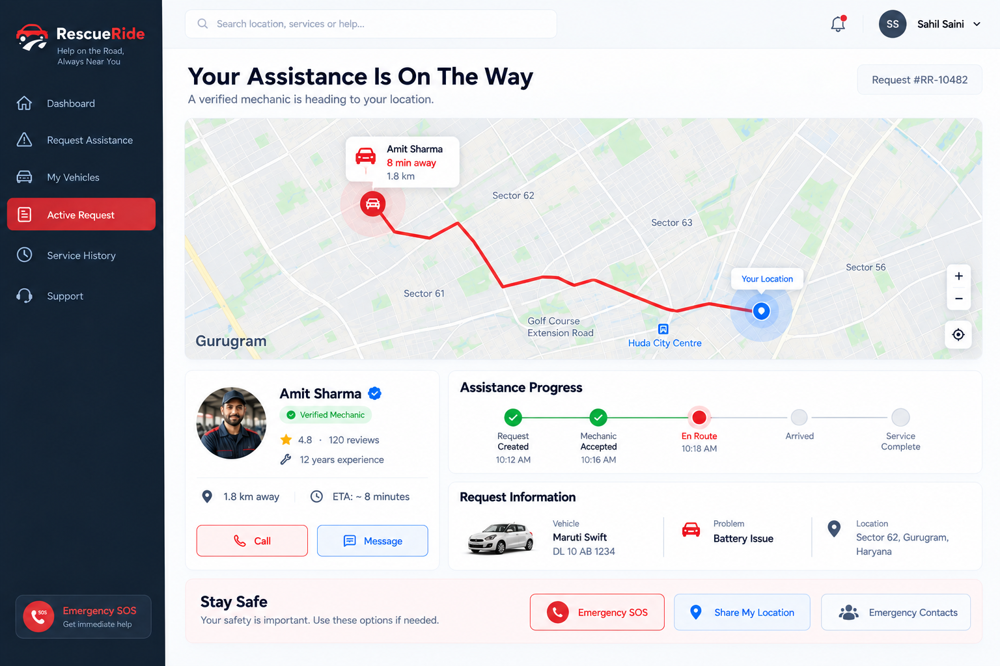
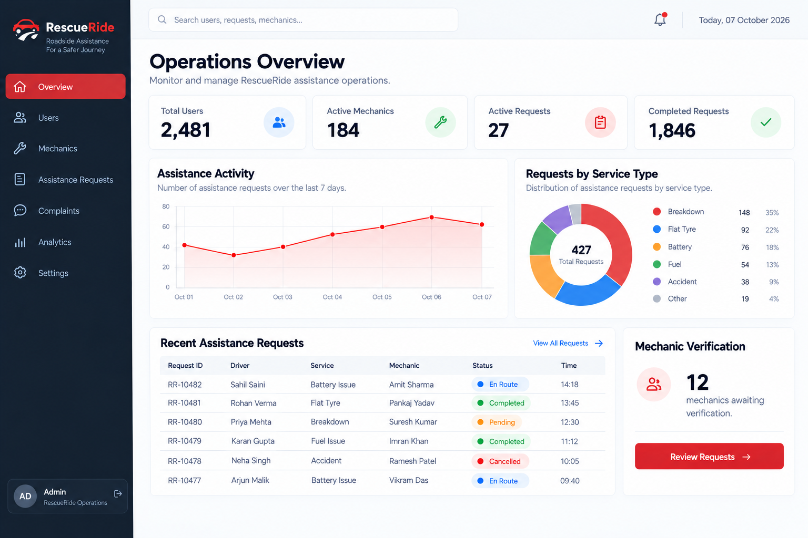

# 🚗 RescueRide

  <strong>Roadside Assistance and Mechanic Coordination System</strong>

  
  
  
  

---

# 🚘 About the Project

**RescueRide** is a web-based roadside assistance and mechanic coordination platform designed to help drivers manage vehicle breakdowns, mechanical failures, and roadside emergencies through a unified digital system.

Instead of functioning only as a mechanic-finding application, RescueRide aims to connect:

**Drivers → Assistance Requests → Mechanic Discovery → Job Coordination → Service Completion → Feedback & Administration**

The system is designed around three primary users:

| User | Role |
|---|---|
| 🚗 **Driver** | Reports vehicle problems, provides vehicle/location details, requests assistance, communicates with mechanics, and tracks service progress. |
| 🔧 **Mechanic** | Manages availability, receives assistance requests, accepts suitable jobs, communicates with drivers, and manages service completion. |
| 🛡️ **Administrator** | Manages users and mechanics, monitors requests and jobs, handles complaints and governance activities, and accesses system-level information. |

### Core Project Areas

  
  
  
  
  
  
  
  

---

# 👨‍🏫 Project Guide

| | |
|---|---|
| **Project Guide** | **Er. Ram Babu Buri** |
| **Research Area** | **Machine Learning & Data Science** |
| **Specializations** | **Java · JSP–Servlet · Spring Boot · MySQL · Python** |

---

# 👥 Team Members

| # | Team Member | Enrollment No. |
|:---:|---|---|
| 🧑‍💻 **01** | **Sahil Saini** | `24E1ARCSM30P141` |
| 🧑‍💻 **02** | **Nitin Singh Shekhawat** | `24E1ARITM40P037` |
| 🧑‍💻 **03** | **Sakshi Kumari Singh** | `24E1ARCSF40P143` |
| 🧑‍💻 **04** | **Rajat Tailor** | `24E1ARCSM30P126` |

---

# 📘 Week 1 — Project Initiation & Problem Discovery

  
  
  
  

## 🎯 Week Objective

The objective of Week 1 was to establish the foundation of the project by finalizing the team, identifying a genuine real-world problem, conducting preliminary research, discussing a suitable software-based solution, selecting the project guide, and preparing the initial project abstract.

---

## 📅 Daily Progress

| Date | Activity | Outcome |
|---|---|---|
| **06 July 2026** | Discussion for team members | Discussed team formation, individual interests, availability, and project expectations. |
| **07 July 2026** | Finalizing team members | Finalized the four-member project team. |
| **08 July 2026** | Finding a real-life problem | Evaluated multiple real-world problems and identified roadside assistance as a suitable project domain. |
| **09 July 2026** | Research for the problem | Conducted preliminary research on vehicle breakdowns and roadside assistance requirements. |
| **10 July 2026** | Discussion for solution | Discussed possible software-based solutions and established the initial RescueRide concept. |
| **11 July 2026** | Discussion & selection of project guide | Discussed project requirements and finalized the project guide. |
| **12 July 2026** | Preparation of Abstract | Prepared and reviewed the initial project abstract. |

---

# 📄 Week 1 — Project Abstract

## RescueRide: Roadside Assistance and Mechanic Coordination System

**RescueRide: Roadside Assistance and Mechanic Coordination System** is a web-based roadside assistance platform designed to help drivers manage vehicle breakdowns, mechanical failures, and roadside emergencies through a unified digital system. Instead of functioning as a simple mechanic-finding application, RescueRide connects **drivers, suitable mechanics, real-time job coordination, service management, and administration** into a structured assistance workflow.

The platform allows drivers to maintain vehicle information, report breakdowns, provide symptoms and problem details, share their location, and request roadside assistance. Based on the reported problem, required service, location, mechanic availability, service area, and relevant capabilities, the system supports **nearby mechanic discovery and mechanic matching**.

After a mechanic accepts a request, the system supports job assignment, communication, status updates, estimated arrival information, service progress, completion, and service history. The assistance lifecycle can progress through stages such as:

`REQUESTED` → `MATCHED` → `ACCEPTED` → `EN ROUTE` → `ARRIVED` → `DIAGNOSING` → `REPAIRING` → `COMPLETED` → `CLOSED`

The system also focuses on **real-time assistance and safety**, including location-based coordination, assistance tracking, status visibility, ETA information, and prioritization of urgent requests where supported. An administration and analytics layer enables authorized administrators to manage users and mechanics, verify information, monitor requests and jobs, handle complaints and governance activities, maintain audit records, and generate operational insights.

### Overall Workflow

**Driver**  
↓  
**Problem Report**  
↓  
**Vehicle & Location**  
↓  
**Assistance Discovery**  
↓  
**Mechanic Matching**  
↓  
**Job Coordination**  
↓  
**Service Completion**  
↓  
**Feedback & Analytics**

By combining roadside assistance, mechanic coordination, real-time assistance, safety-oriented functionality, vehicle information, service management, and administrative analytics, RescueRide aims to create a more organized, transparent, and efficient approach to roadside assistance management.

### Technology / Concept Areas

  
  
  
  
  
  
  
  
  

---

## 🔍 Week 1 Outcomes

- ✅ Four-member project team finalized.
- ✅ Roadside assistance identified as the primary problem domain.
- ✅ Preliminary problem research completed.
- ✅ Initial solution concept established.
- ✅ Primary system users identified.
- ✅ Project guide selected.
- ✅ Initial project abstract prepared.
- ✅ Initial RescueRide workflow established.

---

## ⚠️ Problems Faced

- Finalizing the team required discussion regarding member availability, interests, and responsibilities.
- Identifying a genuine and feasible real-world problem required evaluation of multiple ideas.
- The initial problem scope was broad and required refinement into a manageable software project.
- Additional discussion was required to convert the identified problem into a clear system concept.

---

## 📌 Plan for Week 2

- Conduct detailed research on the roadside assistance problem.
- Study existing solutions and identify their limitations.
- Identify user pain points and system requirements.
- Define Driver, Mechanic, and Administrator workflows.
- Identify functional and non-functional requirements.
- Determine the major functional modules of RescueRide.
- Define the scope and responsibilities of each module.
- Begin preparation of the **Software Requirements Specification (SRS)**.
- Review the proposed requirements with the project guide.

---

# 📊 Week 1 Summary

| Category | Status |
|---|---|
| Team Formation | 🟢 Completed |
| Problem Identification | 🟢 Completed |
| Preliminary Research | 🟢 Completed |
| Solution Ideation | 🟢 Completed |
| Guide Selection | 🟢 Completed |
| Abstract Preparation | 🟢 Completed |
| Detailed Requirements | 🟡 Planned for Week 2 |
| SRS | 🟡 Planned for Week 2 |
| System Design | ⚪ Upcoming |
| Development | ⚪ Upcoming |

---

  <strong>Week 1 Completed</strong> 
  Next Phase: Detailed Problem Research & SRS Preparation

# 📘 Week 2 — Requirements Analysis & SRS

> **Week 2 Focus:** Converting the identified roadside-assistance problem into a structured and implementable system specification.

---

## 🎯 Objective

The objective of Week 2 was to analyze the roadside-assistance domain and convert the identified problem into clear **functional, non-functional and system requirements**.

The team finalized the system actors, major modules, core workflow, constraints and responsibilities, and documented them in the **Software Requirements Specification (SRS)**.

## 📄 Software Requirements Specification

The complete Software Requirements Specification (SRS) contains the detailed system requirements, actors, functional modules, interfaces, constraints, security requirements and system workflow.

**📎 Complete SRS Document:** [View SRS on Google Drive](https://drive.google.com/file/d/1RKLEE5QCETM2Qk3E7Ws5ywN3C3ZwtriL/view?usp=sharing)

During Week 2, the team prepared the **Software Requirements Specification (SRS)** to formally define how RescueRide will operate and what the system must provide.

The SRS established the following core aspects of the system:

- **Three system actors:** Driver, Mechanic and Administrator, with clearly defined responsibilities for each role.
- **Complete assistance workflow:** Driver → Problem Report → Vehicle & Location → Assistance Discovery → Mechanic Matching → Job Coordination → Service Completion → Feedback & Analytics.
- **Request lifecycle:** Requested → Matched → Accepted → En Route → Arrived → Diagnosing → Repairing → Completed → Closed.
- **Five major functional modules:** Roadside Assistance & Rescue Discovery, Vehicle Management & Service History, Mechanic Service & Job Management, Real-Time Assistance & Safety, and Administration, Governance & Analytics.
- **System integration:** Common role-based access, shared job status, linked request/service records, real-time communication and coordinated module operations.
- **Technology foundation:** HTML, CSS and JavaScript for the frontend, Java for backend development, PostgreSQL for database management, Leaflet/OpenStreetMap for maps and location services, and WebSocket or polling for real-time updates.
- **Project boundaries:** The system is planned as a responsive web platform, while native mobile applications, online payment processing, physical towing fleets and insurance claim handling remain outside the defined scope.

### 👥 System Actors

| Actor | Responsibility |
|---|---|
| **Driver** | Manage profile and vehicles, report breakdowns, request assistance, select mechanics, track jobs, chat, rate services and manage emergency information. |
| **Mechanic** | Manage profile and availability, verify credentials, receive requests, submit quotes, accept jobs, update status, navigate, complete jobs and manage earnings. |
| **Administrator** | Verify mechanics, manage users, monitor requests and jobs, handle complaints, manage SOS events, moderation and system analytics. |

---

## 🧩 Core Modules Defined

| Module | Primary Responsibility |
|---|---|
| **M1 — Roadside Assistance & Rescue Discovery** | Breakdown reporting, location capture and suitable mechanic discovery |
| **M2 — Vehicle Management & Service History** | Vehicle records, previous services and maintenance information |
| **M3 — Mechanic Service & Job Management** | Requests, quotes, job lifecycle and service completion |
| **M4 — Real-Time Assistance & Safety** | Tracking, communication, notifications and emergency assistance |
| **M5 — Administration, Governance & Analytics** | Verification, monitoring, complaints, governance and analytics |

---

## 🔄 Core Assistance Workflow

**Driver → Problem Report → Vehicle & Location → Mechanic Discovery → Mechanic Selection → Job Coordination → Service Completion → Feedback**

The SRS also defined the assistance lifecycle:

**Requested → Matched → Accepted → En Route → Arrived → Diagnosing → Repairing → Completed → Closed**

---

## 📌 Sample Functional Requirements

The SRS converted the identified features into numbered functional requirements.

| ID | Requirement |
|---|---|
| **FR-1.1** | Driver registration, login, logout and profile management |
| **FR-1.2** | Add, edit and delete vehicle information |
| **FR-1.3** | Create a rescue request with problem, symptoms and urgency |
| **FR-1.4** | Capture breakdown location through geolocation or map selection |
| **FR-1.5** | Find verified and available mechanics suitable for the reported problem |
| **FR-1.6** | Display matched mechanics with distance, rating, specialisation and ETA |
| **FR-1.10** | Allow request cancellation with a reason |
| **FR-1.12** | Allow rating and review after a completed job |

---

## ⚠️ Problems Faced

- Existing roadside-assistance solutions had to be analyzed to identify meaningful gaps.
- Initial requirements were broader than the achievable project scope and required refinement.
- Research findings had to be converted into measurable system requirements.
- Responsibilities of the three user roles required multiple discussions.
- The five modules had to be structured as interconnected parts of one system.

---

## 📦 Week 2 Outcomes

| Deliverable | Status |
|---|:---:|
| Problem & Solution Scope | ✅ |
| System Actors | ✅ |
| Five Core Modules | ✅ |
| Functional Requirements | ✅ |
| Non-Functional Requirements | ✅ |
| Security & Constraints | ✅ |
| **Software Requirements Specification** | **✅** |

---

## 🔜 Plan for Week 3

- 🏗️ Design overall system architecture.
- 👥 Prepare Use Case Diagrams.
- 🧱 Prepare Class Diagrams.
- 🔄 Prepare Activity Diagrams.
- 🔁 Prepare Sequence Diagrams.
- 👨‍🏫 Review designs with the project guide.
- ✅ Finalize the design foundation before implementation.

---

### ✅ Week 2 Complete

**Problem Analyzed • Requirements Defined • Five Modules Finalized • SRS Completed**

# 📐 Week 3 — UML & System Design

> **Week 3 Focus:** Translating the finalized SRS requirements into system interactions, workflows, entities and UML-based design.

---

## 🎯 Objective

The objective of Week 3 was to convert the requirements finalized in the SRS into a structured system design.

The team identified the major actors and use cases, defined relationships between system entities, and modeled important RescueRide workflows using **Use Case, Class, Activity and Sequence Diagrams**.

---

## 📐 UML Design

The system design was represented through four major UML diagrams.

### 1. 🔄 Activity Diagram

The Activity Diagram represents the primary roadside-assistance workflow, starting from driver login and rescue request creation through mechanic discovery, assignment, tracking, service and payment.

---

### 2. 🔁 Sequence Diagram

The Sequence Diagram represents the interaction between the **Driver, System, Mechanic and Notification** components during a rescue request and service lifecycle.

---

### 3. 🧱 Class Diagram

The Class Diagram defines the major entities of RescueRide and their relationships, including:

- **Driver**
- **Vehicle**
- **Rescue Request**
- **Mechanic**
- **Maintenance**
- **Service**
- **Payment**
- **Chat**
- **Notification**
- **Administrator**

---

### 4. 👥 Use Case Diagram

The Use Case Diagram maps the major system functionalities to the three primary actors:

**Driver • Mechanic • Administrator**

It covers vehicle management, rescue requests, mechanic operations, communication and safety, administration and analytics.

---

## 🔗 Design Coverage

The UML design was aligned with the requirements defined during Week 2.

| Design Area | Covered Through |
|---|---|
| 👤 User Roles & Responsibilities | Use Case Diagram |
| 🚨 Rescue Request Workflow | Activity Diagram |
| 🔄 System Interactions | Sequence Diagram |
| 🧱 System Entities & Relationships | Class Diagram |
| 🔧 Mechanic Operations | Use Case + Sequence Diagram |
| 🛡️ Administration | Use Case + Class Diagram |

---

## ⚠️ Problems Faced

- Some relationships between system components and user interactions were initially unclear while preparing the UML diagrams.
- Defining module boundaries was challenging because some features required interaction between multiple modules.
- Different implementation approaches were discussed before finalizing the technology stack and project structure.

---

## 📦 Week 3 Outcomes

| Deliverable | Status |
|---|:---:|
| System Actors & Use Cases | ✅ Completed |
| Use Case Diagram | ✅ Completed |
| Class Diagram | ✅ Completed |
| Activity Diagram | ✅ Completed |
| Sequence Diagram | ✅ Completed |
| SRS–UML Alignment Review | ✅ Completed |
| **UML Documentation** | **✅ Completed** |

---

## 🔜 Plan for Week 4

- 👨‍🏫 Finalize and review all UML diagrams with the project guide.
- 🗄️ Complete the database schema and define entity relationships.
- 🧩 Prepare initial database tables and constraints.
- 🎨 Design UI mock-ups for the major pages of each module.
- ⚙️ Finalize the Spring Boot/Java project structure and development workflow.
- 🚀 Begin implementation of the core database and backend foundation.

---

### ✅ Week 3 Complete

**System Actors Defined • UML Designed • Workflows Modeled • Design Foundation Finalized**

# 🗄️ Week 4 — Database Design & UI Mock-ups

> **Week 4 Focus:** Translating the UML design into a structured database model and creating the initial UI design for the five major RescueRide modules.

---

## 🎯 Objective

The objective of Week 4 was to finalize the **database structure** and establish the initial **user interface design** before starting implementation.

The team identified the required database entities from the SRS and UML diagrams, defined their relationships and constraints, prepared the ER design, and created UI mock-ups covering the major workflows of the **Driver, Mechanic and Administrator**.

---

# 🗄️ Database Design

The database design was derived from the **SRS, UML Class Diagram and major system workflows**.

The design establishes relationships between users, vehicles, rescue requests, mechanics, locations, services, payments, tracking, reviews and administrative records.

### 🔑 Major Database Entities

| Category | Entities |
|---|---|
| 👤 **Users & Access** | User • Driver • Mechanic • Admin • Roles |
| 🚗 **Vehicle** | Vehicle • Maintenance • Service History |
| 🚨 **Assistance** | Service Request • Location • Tracking |
| 🔧 **Mechanic & Service** | Mechanic • Service Record • Quotation • Payment |
| 💬 **Communication** | Chat • Notification |
| 🛡️ **Safety & Governance** | Emergency Contact • Incident • Escalation • Admin Log |
| 📊 **Feedback & Analytics** | Rating • Review • Analytics |

---

## 🔗 Entity Relationship Design

The ER design defines the relationships between the core system entities.

Key relationships include:

- A **User** can own multiple vehicles.
- A **User** can create multiple service requests.
- A **Vehicle** can have multiple service records.
- A **Service Request** is associated with a vehicle, location and mechanic.
- A **Mechanic** can handle multiple service requests.
- A request can generate service, payment, tracking and feedback records.
- Administrative actions are recorded through audit logs.

### 📐 ER Diagram

---

## 🎨 UI Mock-ups

The UI design was prepared around the five major RescueRide modules and their primary user workflows.

The design follows a consistent visual language across the **Driver, Mechanic and Administrator** interfaces.

---

### 🚨 M1 — Roadside Assistance & Rescue Discovery

The mock-up represents the driver workflow for:

**Problem Selection → Vehicle Selection → Location Confirmation → Nearby Mechanic Discovery**

---

### 🚗 M2 — Vehicle Management & Service History

The Driver vehicle interface provides:

- Vehicle management
- Vehicle details
- Service history
- Maintenance information
- Next recommended service

---

### 🔧 M3 — Mechanic Service & Job Management

The Mechanic dashboard provides:

- Active and completed jobs
- Customer information
- Job location
- Job status
- Service details
- Service charges
- Job progress

---

### 📍 M4 — Real-Time Assistance & Safety

The active assistance interface provides:

- Live mechanic location
- Driver location
- ETA
- Assistance progress
- Request information
- Calling and messaging
- Emergency SOS
- Location sharing
- Emergency contacts

---

### 📊 M5 — Administration, Governance & Analytics

The administrator interface provides an operational overview of:

- Total users
- Active mechanics
- Active and completed requests
- Assistance activity
- Service-type distribution
- Recent requests
- Mechanic verification

---

## 🧩 Design Coverage

| Area | Designed |
|---|:---:|
| Database Entities | ✅ |
| Entity Relationships | ✅ |
| Database Constraints | ✅ |
| Driver Workflow UI | ✅ |
| Mechanic Workflow UI | ✅ |
| Administrator UI | ✅ |
| Five Core Modules | ✅ |
| SRS–Database Alignment | ✅ |
| SRS–UI Alignment | ✅ |

---

## ⚠️ Problems Faced

- Translating the UML design into an actual database schema required adjustments to entity relationships and constraints.
- Some database fields and relationships needed modification after considering the actual workflows of the five modules.
- Integrating the database design with the Java backend structure required careful mapping of entities and relationships.
- The team had to coordinate module boundaries so that individual development would not create conflicting database or API structures.

---

## 📦 Week 4 Outcomes

| Deliverable | Status |
|---|:---:|
| Database Entities Identified | ✅ Completed |
| Entity Relationships Defined | ✅ Completed |
| Database Schema Designed | ✅ Completed |
| ER Diagram | ✅ Completed |
| Database Normalization Review | ✅ Completed |
| Driver UI Mock-ups | ✅ Completed |
| Mechanic UI Mock-ups | ✅ Completed |
| Administrator UI Mock-ups | ✅ Completed |
| **Database & UI Design Foundation** | **✅ Completed** |

---

## 🔜 Plan for Week 5

- 🗄️ Complete implementation of the database schema.
- ⚙️ Finalize the Java/Spring Boot backend project structure.
- 🧱 Create required entities, repositories, services and initial controllers.
- 🚀 Begin implementation of the core functionality of assigned modules.
- 🎨 Develop initial frontend pages based on the approved UI mock-ups.
- 🔗 Establish API contracts between frontend and backend components.
- 🧪 Perform basic module-level testing during development.
- 📚 Continue maintaining GitHub commits and weekly documentation for individual contributions.

### ✅ Week 4 Complete

**Database Designed • ER Model Finalized • UI Mock-ups Completed • Development Ready**

